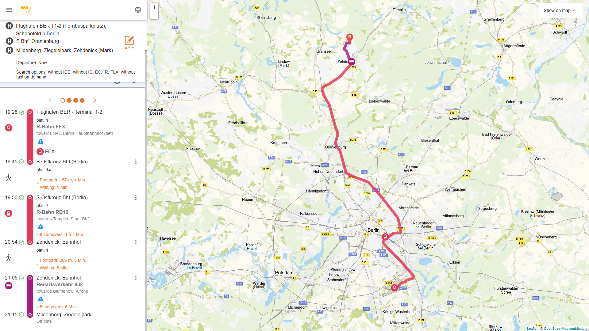
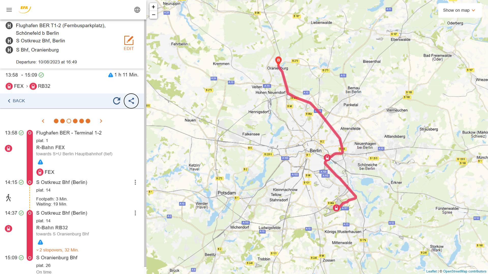
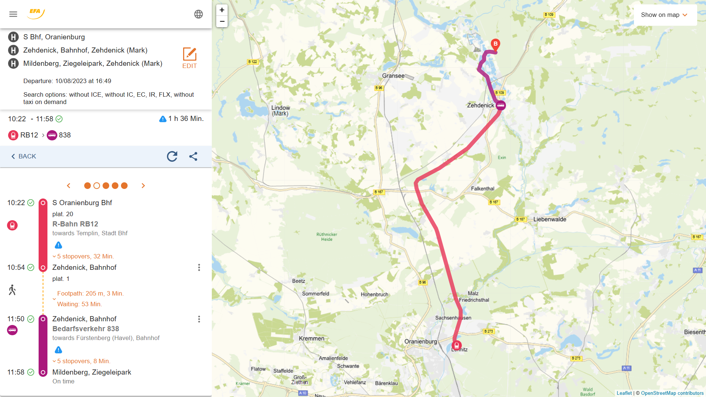

# 2 milliways - one github route

```mermaid
%%{init: {'gitGraph': {'showBranches': true, 'showCommitLabel':true,'mainBranchName': "universe"}}}%%
gitGraph
branch "Road to Millyways"
checkout "Road to Millyways"
commit id: "Home"
branch "Berlin via BER"
commit id:"Departure"
commit id:"Arrival"
commit id:"Berlin BER Terminal 1 station"
checkout "Road to Millyways"
commit id:"Railway Station"
branch "Berlin via DB"
commit id:"any DB station"
merge "Berlin via BER" tag:"LEX"
commit id:"Berlin S Bhf Ostkreuz"
branch "Zehdenick via Regional"
checkout "Berlin via DB"
commit id:"Berlin Tief"
branch "Gransee via Regional"
commit id:"Oranienburg"
checkout "Zehdenick via Regional"
merge "Gransee via Regional" tag:"Oranienburg"
checkout "Gransee via Regional"
commit id:"Gransee Bhf"
checkout "Berlin via DB"
checkout "Zehdenick via Regional"
commit id:"Zehdenick (Mark) Bhf"
checkout "Zehdenick via Regional"
commit id:"Call Bus 838"
checkout "Road to Millyways"
merge "Zehdenick via Regional" tag:"Ziegeleipark"
checkout "Gransee via Regional"
commit id:"BUS 854" tag:"3x before 1pm"
checkout "Road to Millyways"
merge "Gransee via Regional" tag:"Ziegeleipark"
checkout "Gransee via Regional"
commit id:"Call BUS 833"
checkout "Road to Millyways"
commit id:"CCCAMP23" tag:"On Camp"
checkout "Gransee via Regional"
merge "Zehdenick via Regional" tag:"Black Hole"
checkout "Road to Millyways"

commit id:"Say Hello!" tag:"🚀Milliways"
```

---

## You read it like a github history

You are somewhere in the universe. So you create your trip in a branch `Road to Millyways`. Let's checkout `Road to Millyways` and commit id: `Home`. It's good to have something you want to return to. You need a feature, as you plan to fly. Branch `Berlin via BER`, and going your way, you commit id:`Departure`, commit id:`Arrival` and find the train station. commit id:`Berlin BER Terminal 1 station`. Now you go on train, so create branch `Berlin via DB` and merge `Berlin via BER` tag:`LEX`. Because `LEX` is the best choice to reach your next milestone. commit id:`Berlin S Bhf Ostkreuz`. You change the train to branch `Zehdenick via Regional`, and commit id:`Oranienburg`. Don't forget to watch out for others coming from branch `Gransee via Regional`. Short after commit id:`Zehdenick (Mark) Bhf`, you should commit id:`Call Bus 838`. Now it should work like a charme, so checkout `Road to Millyways`, merge `Zehdenick via Regional` tag:`Ziegeleipark`, get your tickets ready, commit id:`CCCAMP23` tag:`On Camp` and finally commit id:`Say Hello!` tag:`🚀Milliways`.

---

## Waypoints' names you need

In the order you need them on your way from `✈️BER` to `🚀Milliways`

- `Berlin BER Terminal 1 & 2, (b. Schöneberg)`: The Railway station at `BER` Airport.
- `FEX`: Regional train, best to travel from `✈️BER` to `Berlin S Ostkreuz Bhf`.
- `Berlin S Ostkreuz Bhf`: Train station, it's near `Ostbahnhof`, but it's a different station.
- `RE12`: Regional Train (from `Berlin S Ostkreuz Bhf` to `Templin` via `Zehdenick`)
- `S Bhf Oranienburg`: Train station (north of Berlin), the last station, that `RB5` and `RB12` stop. Last chance to get on the right `RB12`.
- `Zehdenick (Mark) Bahnhof`: Railway Station next to 🚀Milliways
- `Mildenberg, Ziegeleipark`: Bus Stop next to 🚀Milliways

## Waypoints you probably will see while using maps

- `S Ostbahnhof, Berlin`: nice, but useless to reach Milliways, also called `Berlin Ost-Bhf`, you want `Berlin S Ostkreuz Bhf`.
- `Hauptbahnhof (Invalidenstr.), Berlin`: outside Main Station, Bus and Tram
- `S+U Berlin Hauptbahnhof (tief)`: Main station basement, Regional trains
- `S+U Zoologischer Garten Bhf, Berlin`: called `Bahnhof Zoo`, useless for our trip
- `RE5`: Regional train (from `S+U Berlin Hauptbahnhof (tief)` to `Rostock` via `Gransee, Bahnhof`)
- `Gransee, Bahnhof`: Train station (50km west of 🚀Milliways), on the route of `RB5` to the Eastern Sea.

---

## Hitchhikers guide from `✈️BER` to `🚀Milliways`

This is how your trip will look like.

### Arrival at BER, take LEX, get on RB12 at Ostkreuz and reach Milliways

[`Berlin, BER Terminal 1` -> `S Bhf Ostkreuz` ->  `Ziegeleipark Mildenberg`](https://www.efa.de/hitsl3plus/trip/0?formik=destination%3Dde%253A12065%253A900204019%26mtcb0%3Dfalse%26mtcb1%3Dfalse%26mtcb10%3Dfalse%26origin%3D37004885%26via%3Dde%253A12065%253A900200005&lng=en&sharedLink=true)

But universe is a dynamic thingy, so we device your trip in smaller steps.

### Part 1 - Reaching Oranienburg via Ostkreuz

There is a huge railway cross called `S Bhf Ostkreuz`. It's near to `Ostbahnhof`, but it is your best choice to go to `S Bhf Oranienburg`. Because Oranienburg is where the train `RB12` will come along on it's way to Zehdenick.

[`Berlin, BER Terminal 1` -> `S Bhf Ostkreuz` ->  `S Bhf Oranienburg`](https://www.efa.de/hitsl3plus/trip?formik=destination%3Dde%253A12065%253A900200005%26mtcb0%3Dfalse%26mtcb1%3Dfalse%26mtcb10%3Dfalse%26origin%3D37004885%26via%3Dde%253A11000%253A900120003&lng=en&sharedLink=true)

### Part 2 - Take the RB12 to Zehdenick

Depending on which routing app you ask, it will probably offer a route, that is not using `RB12`. That's bad, in most cases, because you will end up in `Gransee`, where you will have to call a bus. Because the direct bus goes only 3 times a day to Zehdenick. And that's before approx. 1 pm.

You want to take `RB12` to `Templin` via `Zehdenick`

[`S Bhf Oranienburg` -> `Zehdenick, Bahnhof` -> `Ziegeleipark Mildenberg`](https://www.efa.de/hitsl3plus/trip/1?formik=destination%3Dde%253A12065%253A900204019%26mtcb0%3Dfalse%26mtcb1%3Dfalse%26mtcb10%3Dfalse%26origin%3Dde%253A12065%253A900200005%26via%3Dde%253A12065%253A900203853&lng=en&sharedLink=true&trip=earlier%3D1)

