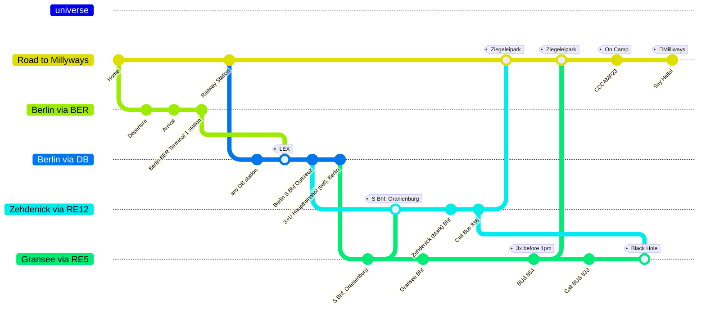
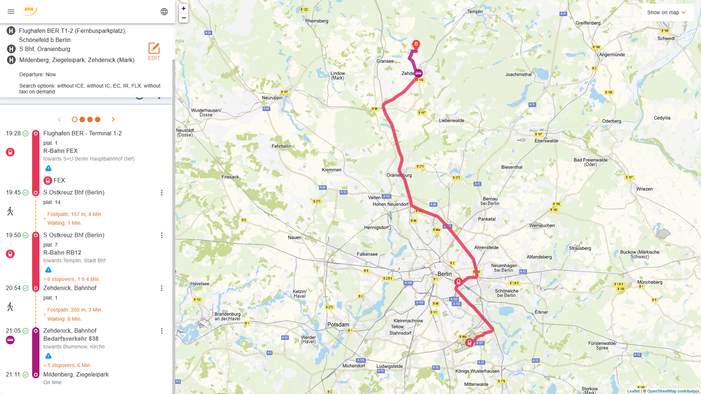
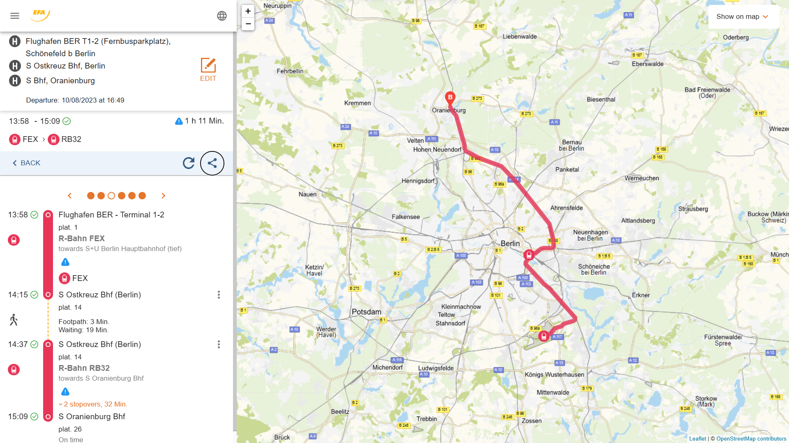
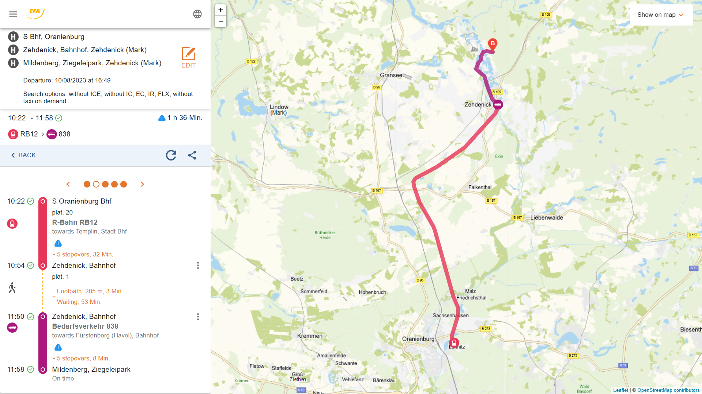

# 2 milliways - one github route

---

- [How to read the plan](#you-read-it-like-a-github-history)
- [Waypoint names for route planning](#waypoints-names-you-need)
- [You are coming by plane to ✈️BER](#hitchhikers-guide-from-✈️ber-to-🚀milliways)

## You read it like a github history

You are somewhere in the universe. So you create your trip in a branch `Road to Millyways`. Let's checkout `Road to Millyways` and commit id: `Home`. It's good to have something you want to return to. You need a feature, as you plan to fly. Branch `Berlin via BER`, and going your way, you commit id:`Departure`, commit id:`Arrival` and find the train station. commit id:`Berlin BER Terminal 1 station`. Now you go on train, so create branch `Berlin via DB` and merge `Berlin via BER` tag:`LEX`. Because `LEX` is the best choice to reach your next milestone. commit id:`Berlin S Bhf Ostkreuz`. You change the train to branch `Zehdenick via RE12`, and commit id:`S Bhf, Oranienburg`. Don't forget to watch out for others coming from branch `Gransee via RE5`. Short after commit id:`Zehdenick (Mark) Bhf`, you should commit id:`Call Bus 838`. Now it should work like a charme, so checkout `Road to Millyways`, merge `Zehdenick via RE12` tag:`Ziegeleipark`, get your tickets ready, commit id:`CCCAMP23` tag:`On Camp` and finally commit id:`Say Hello!` tag:`🚀Milliways`.

---

## Waypoints' names you need

In the order you need them on your way from `✈️BER` to `🚀Milliways`

- `Berlin BER Terminal 1 & 2, (b. Schöneberg)`: The Railway station at `BER` Airport.
- `FEX`: Regional train, best to travel from `✈️BER` to `Berlin S Ostkreuz Bhf`.
- `Berlin S Ostkreuz Bhf`: Train station, it's near `Ostbahnhof`, but it's a different station.
- `RE12`: Regional Train (from `Berlin S Ostkreuz Bhf` to `Templin` via `Zehdenick`)
- `S Bhf S Bhf, Oranienburg`: Train station (north of Berlin), the last station, where `RB5` and `RB12` stop both. Last chance to get on the right `RB12`.
- `Zehdenick (Mark) Bahnhof`: Railway Station next to 🚀Milliways
- `Mildenberg, Ziegeleipark`: Bus Stop next to 🚀Milliways

## Waypoints you probably will see while using maps

- `S Ostbahnhof, Berlin`: nice, but useless to reach Milliways, also called `Berlin Ost-Bhf`, you want `Berlin S Ostkreuz Bhf`.
- `Hauptbahnhof (Invalidenstr.), Berlin`: outside Main Station, Bus and Tram
- `S+U Berlin Hauptbahnhof (tief)`: Main station basement, Regional trains
- `S+U Zoologischer Garten Bhf, Berlin`: called `Bahnhof Zoo`, useless for our trip
- `RE5`: Regional train (from `S+U Berlin Hauptbahnhof (tief)` to `Rostock` via `Gransee, Bahnhof`)
- `Gransee, Bahnhof`: Train station (50km west of 🚀Milliways), on the route of `RB5` to the Eastern Sea.

---

## Hitchhikers guide from `✈️BER` to `🚀Milliways`

This is how your trip will look like.

### Arrival at BER, take LEX, get on RB12 at Ostkreuz and reach Milliways

[`Berlin, BER Terminal 1` -> `S Bhf Ostkreuz` ->  `Ziegeleipark Mildenberg`](https://www.efa.de/hitsl3plus/trip/0?formik=destination%3Dde%253A12065%253A900204019%26mtcb0%3Dfalse%26mtcb1%3Dfalse%26mtcb10%3Dfalse%26origin%3D37004885%26via%3Dde%253A12065%253A900200005&lng=en&sharedLink=true)

But universe is a dynamic thingy, so we divide your trip in smaller steps.

### Part 1 - Reaching S Bhf, Oranienburg via Ostkreuz

There is a huge railway cross called `S Bhf Ostkreuz`. It's near to `Ostbahnhof`, but it is your best choice to go to `S Bhf S Bhf, Oranienburg`. Because S Bhf, Oranienburg is where the train `RB12` will come along on it's way to Zehdenick.

[`Berlin, BER Terminal 1` -> `S Bhf Ostkreuz` ->  `S Bhf S Bhf, Oranienburg`](https://www.efa.de/hitsl3plus/trip?formik=destination%3Dde%253A12065%253A900200005%26mtcb0%3Dfalse%26mtcb1%3Dfalse%26mtcb10%3Dfalse%26origin%3D37004885%26via%3Dde%253A11000%253A900120003&lng=en&sharedLink=true)

### Part 2 - Take the RB12 to Zehdenick

Depending on which routing app you ask, it will probably offer a route, that is not using `RB12`. That's bad, in most cases, because you will end up in `Gransee`, where you will have to call a bus. Because the direct bus goes only 3 times a day to Zehdenick. And that's before approx. 1 pm.

You want to take `RB12` to `Templin` via `Zehdenick`

[`S Bhf S Bhf, Oranienburg` -> `Zehdenick, Bahnhof` -> `Ziegeleipark Mildenberg`](https://www.efa.de/hitsl3plus/trip/1?formik=destination%3Dde%253A12065%253A900204019%26mtcb0%3Dfalse%26mtcb1%3Dfalse%26mtcb10%3Dfalse%26origin%3Dde%253A12065%253A900200005%26via%3Dde%253A12065%253A900203853&lng=en&sharedLink=true&trip=earlier%3D1)

## Hitchhikers guide for trains from 🚂Berlin to 🚀Milliways

I assume you will reach Berlin at main station, name for any routing app is `S+U Hauptbahnhof (tief), Berlin`. Your target is Ziegeleipark Mildenberg, name in routing apps is `Mildenberg, Ziegeleipark, Zehdenick (Mark)`.

We have two train stations near 🚀Milliways.

- [Zehdenick, Bahnhof, Zehdenick (Mark)](https://www.efa.de/hitsl3plus/departureMonitor?formik=origin%3Dde%253A12065%253A900203853&lng=en)
    Distance 7.3 km
- [Bahnhof, Gransee](https://www.efa.de/hitsl3plus/departureMonitor?formik=origin%3Dde%253A12065%253A900203709&lng=en) Distance 13 km

Main difference between these two is the connection to 🚀Milliways by Bus.

### Zehdenick Bahnhof to 🚀Milliways

From `Zehdenick` there is `Bus 838`, which needs to be called by phone (`☎️ +49 3306 2307`). Call must be made 90 minutes **before** your planned trip. 

On Saturdays, Bus goes every hour from 9 am till 8 pm.

On Sondays from 9 am till 5 pm. 

From Monday till Friday please use link below.

[Find BUS 838 on efa.de](https://www.efa.de/hitsl3plus/departureMonitor?departureMonitor=selectedLines%3DselectedLines%253Dvbb%25253A37838%25253A%252520%25253AH%25253Aj23&formik=origin%3Dde%253A12065%253A900203905&lng=de&sharedLink=true)

---

### Gransee Bahnhof to 🚀Milliways

From `Gransee` there is `BUS 854` direkt drive to 🚀Milliways. 

Only 3 times a day, at:

- 10.40 am
- 11.40 am
- 12.40 am 

**Period**. 

[Check BUS 854 on efa.de](https://www.efa.de/hitsl3plus/departureMonitor?departureMonitor=selectedLines%3DselectedLines%253Dvbb%25253A37854%25253A%252520%25253AH%25253Aj23%26type%3Dstop&formik=origin%3Dde%253A12065%253A900203709&lng=de&sharedLink=true)

All other Busses need to be called by phone, 90 minutes before departure, and do **NOT** go directly to 🚀Milliways. 

Example: `BUS 833` call `☎️ +49 3306 2307`

[Check selected Busses from Gransee on efa.de](https://www.efa.de/hitsl3plus/departureMonitor?departureMonitor=selectedLines%3DselectedLines%253Dvbb%25253A37A00%25253A7%25253AH%25253Aj23%2526selectedLines%253Dvbb%25253A37833%25253A%252520%25253AH%25253Aj23%2526selectedLines%253Dvbb%25253A37854%25253A%252520%25253AH%25253Aj23%26type%3Dstop&formik=origin%3Dde%253A12065%253A900203709&lng=de&sharedLink=true)

